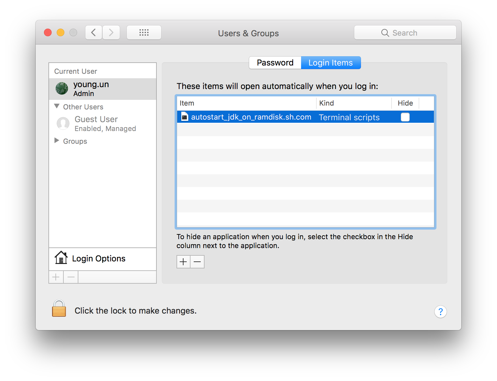
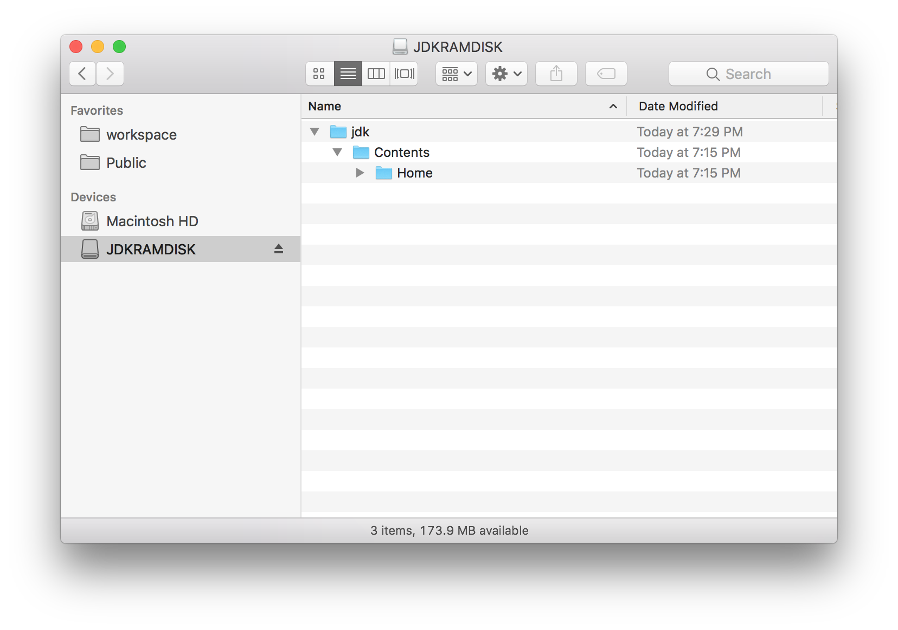

# jdk-on-ramdisk

[7 Tips to Speed Up Eclipse](http://www.nicolasbize.com/blog/7-tips-to-speed-up-eclipse/) 문서의 Tip 3 을 위한 스크립트

### 수정사항
- ramdisk 사이즈를 300MB -> 512MB 로 늘림
- jdk 세부 버전을 자동으로 찾아서 복사하도록 수정

### Screen Shot
 
 
